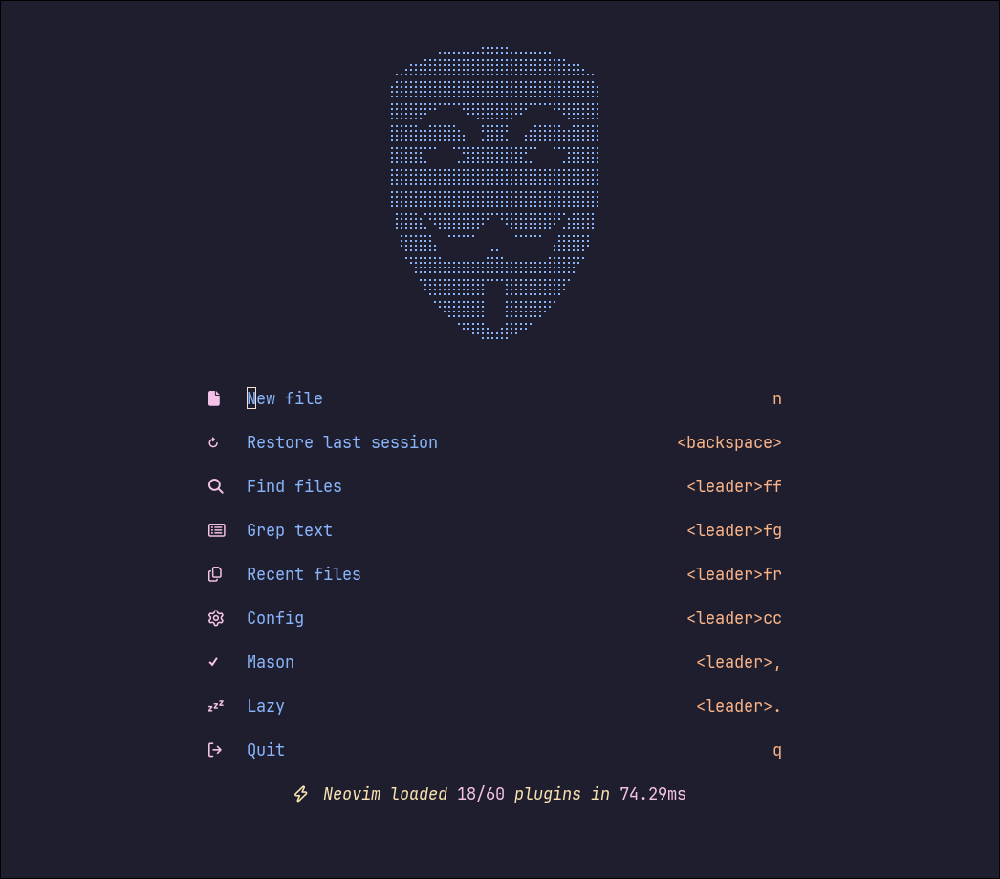

<h1>
  
</h1>

## ⚡️ Requirements

- [Nerd Font](https://www.nerdfonts.com/)
- [lazygit](https://github.com/jesseduffield/lazygit)
- [ripgrep](https://github.com/BurntSushi/ripgrep)
- [fd](https://github.com/sharkdp/fd)

## 💤 Plugin manager

- [lazy.nvim](https://github.com/folke/lazy.nvim)

## 🔌 Plugins

- [arrow.nvim](https://github.com/otavioschwanck/arrow.nvim)
- [auto-save.nvim](https://github.com/okuuva/auto-save.nvim)
- [blink.cmp](https://github.com/saghen/blink.cmp)
- [catppuccin](https://github.com/catppuccin/nvim)
- [ccc](https://github.com/uga-rosa/ccc.nvim)
- [codecompanion.nvim](https://github.com/olimorris/codecompanion.nvim)
- [conform.nvim](https://github.com/stevearc/conform.nvim)
- [copilot.lua](https://github.com/zbirenbaum/copilot.lua)
- [depsync.nvim](https://github.com/robertazzopardi/depsync.nvim)
- [diffview.nvim](https://github.com/sindrets/diffview.nvim)
- [edgy.nvim](https://github.com/folke/edgy.nvim)
- [flash.nvim](https://github.com/folke/flash.nvim)
- [friendly-snippets](https://github.com/rafamadriz/friendly-snippets)
- [gitsigns.nvim](https://github.com/lewis6991/gitsigns.nvim)
- [grug-far.nvim](https://github.com/MagicDuck/grug-far.nvim)
- [helpview.nvim](https://github.com/OXY2DEV/helpview.nvim)
- [incline.nvim](https://github.com/b0o/incline.nvim)
- [lazy.nvim](https://github.com/folke/lazy.nvim)
- [lazydev.nvim](https://github.com/folke/lazydev.nvim)
- [LazyDo](https://github.com/Dan7h3x/LazyDo)
- [lualine.nvim](https://github.com/nvim-lualine/lualine.nvim)
- [LuaSnip](https://github.com/L3MON4D3/LuaSnip)
- [markview.nvim](https://github.com/OXY2DEV/markview.nvim)
- [mason-lspconfig.nvim](https://github.com/williamboman/mason-lspconfig.nvim)
- [mason-tool-installer.nvim](https://github.com/WhoIsSethDaniel/mason-tool-installer.nvim)
- [mason.nvim](https://github.com/williamboman/mason.nvim)
- [mini.icons](https://github.com/echasnovski/mini.icons)
- [mini.sessions](https://github.com/echasnovski/mini.sessions)
- [mini.surround](https://github.com/echasnovski/mini.surround)
- [multicursor.nvim](https://github.com/jake-stewart/multicursor.nvim)
- [neotest-jest](https://github.com/nvim-neotest/neotest-jest)
- [neotest-plenary](https://github.com/nvim-neotest/neotest-plenary)
- [neotest-vitest](https://github.com/marilari88/neotest-vitest)
- [neotest](https://github.com/nvim-neotest/neotest)
- [noice.nvim](https://github.com/folke/noice.nvim)
- [nui.nvim](https://github.com/MunifTanjim/nui.nvim)
- [nvim-autopairs](https://github.com/windwp/nvim-autopairs)
- [nvim-dap-ui](https://github.com/rcarriga/nvim-dap-ui)
- [nvim-dap-virtual-text](https://github.com/theHamsta/nvim-dap-virtual-text)
- [nvim-dap](https://github.com/mfussenegger/nvim-dap)
- [nvim-lint](https://github.com/mfussenegger/nvim-lint)
- [nvim-lspconfig](https://github.com/neovim/nvim-lspconfig)
- [nvim-nio](https://github.com/nvim-neotest/nvim-nio)
- [nvim-treesitter-context](https://github.com/nvim-treesitter/nvim-treesitter-context)
- [nvim-treesitter](https://github.com/nvim-treesitter/nvim-treesitter)
- [nvim-ts-autotag](https://github.com/windwp/nvim-ts-autotag)
- [one-small-step-for-vimkind](https://github.com/jbyuki/one-small-step-for-vimkind)
- [outline.nvim](https://github.com/hedyhli/outline.nvim)
- [plenary.nvim](https://github.com/nvim-lua/plenary.nvim)
- [smartcolumn.nvim](https://github.com/m4xshen/smartcolumn.nvim)
- [snacks.nvim](https://github.com/folke/snacks.nvim)
- [suda](https://github.com/lambdalisue/suda.vim)
- [symbol-usage.nvim](https://github.com/Wansmer/symbol-usage.nvim)
- [todo-comments.nvim](https://github.com/folke/todo-comments.nvim)
- [treewalker.nvim](https://github.com/aaronik/treewalker.nvim)
- [trouble.nvim](https://github.com/folke/trouble.nvim)
- [vim-caddyfile](https://github.com/isobit/vim-caddyfile)
- [vim-maximizer](https://github.com/szw/vim-maximizer)
- [which-key.nvim](https://github.com/folke/which-key.nvim)
- [yazi.nvim](https://github.com/mikavilpas/yazi.nvim)
