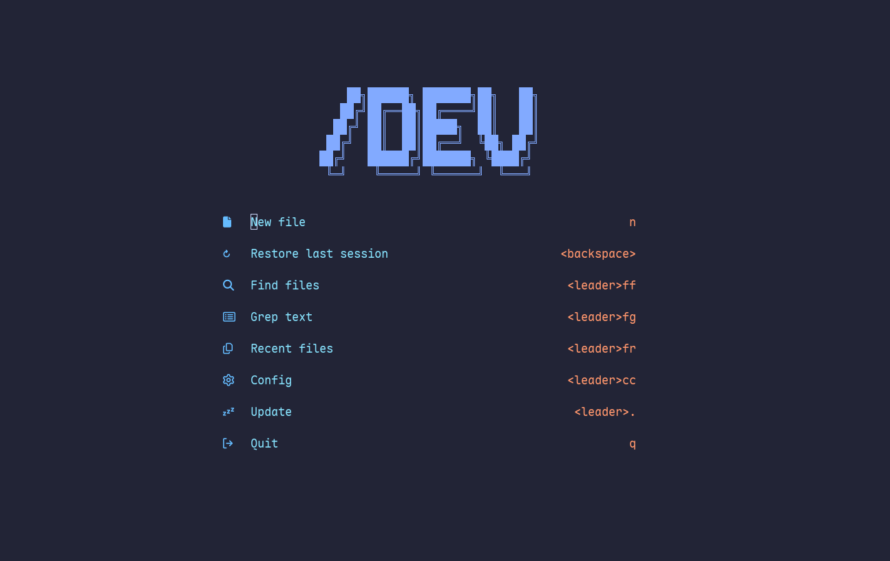

  
  
  # 🌌 Cosmic Neovim Configuration
  
  *Where elegance meets efficiency in the vast expanse of code*
  
  
  
  
  

    <a href="#features">Features</a> •
    <a href="#requirements">Requirements</a> •
    <a href="#flags">Flags</a> •
    <a href="#plugins">Plugins</a>
  

## 🌟 The Ultimate Coding Experience

This configuration transforms Neovim into a **cosmic development environment** where every keystroke feels like navigating through the stars. With carefully curated plugins and intelligent defaults, it provides an unparalleled coding experience that balances beauty, performance, and functionality.

## ✨ Features

### 🎨 Visual Excellence
Dive into a visually stunning coding environment with:
- **Elegant Color Schemes**: Beautiful, carefully crafted themes with transparent backgrounds
- **Dynamic Dashboard**: Custom ASCII art and intuitive startup interface
- **Zen Mode**: Distraction-free coding environment for deep focus
- **Smart Status Column**: Git integration and contextual information at a glance

### 🧠 Artificial Intelligence Integration
Experience the future of coding with AI-powered assistance:
- **Contextual Code Generation**: AI that understands your codebase and generates relevant suggestions
- **Intelligent Explanations**: Get detailed explanations for any code snippet or function
- **Smart Completion**: AI-enhanced autocompletion that anticipates your needs

### ⚡ Lightning Performance
Navigate through code at the speed of thought:
- **Native first**: Try to be as native as possible
- **Instant Startup**: Sub-100ms load times for maximum productivity
- **Memory Optimized**: Efficient resource management for large projects
- **Asynchronous Operations**: Non-blocking UI for seamless interaction
- **Lazy Loading**: Plugins load only when needed for optimal performance

### 🛠️ Advanced Development Tools
Supercharge your development workflow with professional-grade tools:
- **Intelligent Language Support**: Full LSP integration with auto-installed language servers
- **Enhanced Syntax Highlighting**: Tree-sitter powered highlighting for 100+ languages
- **Integrated Debugging**: Full DAP support with beautiful debugging interface
- **Version Control Integration**: Seamless Git integration with inline blame and diff previews
- **Smart Session Management**: Auto-save and restore workspace across sessions
- **Advanced Search & Replace**: Powerful text manipulation across entire projects
- **Code Navigation**: Smart motion and tree-based navigation for complex codebases

## ⚡️ Requirements

- [Nerd Font](https://www.nerdfonts.com/)
- [lazygit](https://github.com/jesseduffield/lazygit)
- [ripgrep](https://github.com/BurntSushi/ripgrep)
- [fd](https://github.com/sharkdp/fd)

## 🏁 Flags

This configuration features a powerful **Flags System** that allows you to customize your Neovim experience with simple boolean flags. Instead of manually editing configuration files, you can easily toggle features on and off through an intuitive interface.

### Accessing Flags
Press `<Leader>F` (by default, Leader is Space) to open the Flags interface where you can enable or disable various features:

- **AI Integration** - Toggle AI-powered code assistance
- **Debugger** - Enable/disable debugging capabilities
- **File Explorer** - Choose between different file explorer implementations
- **Testing Framework** - Enable/disable testing support
- **And many more...**

This system allows you to create a personalized development environment by enabling or disabling features based on your current project needs.

## 🔌 Plugins

- [ansi-nvim](https://github.com/stevedylandev/ansi-nvim)
- [arrow.nvim](https://github.com/otavioschwanck/arrow.nvim)
- [auto-save.nvim](https://github.com/okuuva/auto-save.nvim)
- [blink.cmp](https://github.com/saghen/blink.cmp)
- [conform.nvim](https://github.com/stevearc/conform.nvim)
- [copilot.lua](https://github.com/zbirenbaum/copilot.lua)
- [edgy.nvim](https://github.com/folke/edgy.nvim)
- [everforest-nvim](https://github.com/neanias/everforest-nvim)
- [flash.nvim](https://github.com/folke/flash.nvim)
- [floaterm](https://github.com/nvzone/floaterm)
- [friendly-snippets](https://github.com/rafamadriz/friendly-snippets)
- [gitsigns.nvim](https://github.com/lewis6991/gitsigns.nvim)
- [grug-far.nvim](https://github.com/MagicDuck/grug-far.nvim)
- [helpview.nvim](https://github.com/OXY2DEV/helpview.nvim)
- [lazydev.nvim](https://github.com/folke/lazydev.nvim)
- [lualine.nvim](https://github.com/nvim-lualine/lualine.nvim)
- [markview.nvim](https://github.com/OXY2DEV/markview.nvim)
- [mini.files](https://github.com/echasnovski/mini.files)
- [mini.icons](https://github.com/echasnovski/mini.icons)
- [mini.pairs](https://github.com/echasnovski/mini.pairs)
- [mini.sessions](https://github.com/echasnovski/mini.sessions)
- [mini.surround](https://github.com/echasnovski/mini.surround)
- [neocodeium](https://github.com/monkoose/neocodeium)
- [neotest-jest](https://github.com/nvim-neotest/neotest-jest)
- [neotest-plenary](https://github.com/nvim-neotest/neotest-plenary)
- [neotest-vitest](https://github.com/marilari88/neotest-vitest)
- [neotest](https://github.com/nvim-neotest/neotest)
- [npm-info.nvim](https://github.com/pxnditxyr/npm-info.nvim)
- [nvim-dap-ui](https://github.com/rcarriga/nvim-dap-ui)
- [nvim-dap-virtual-text](https://github.com/theHamsta/nvim-dap-virtual-text)
- [nvim-dap](https://github.com/mfussenegger/nvim-dap)
- [nvim-lint](https://github.com/mfussenegger/nvim-lint)
- [nvim-lspconfig](https://github.com/neovim/nvim-lspconfig)
- [nvim-nio](https://github.com/nvim-neotest/nvim-nio)
- [nvim-treesitter-context](https://github.com/nvim-treesitter/nvim-treesitter-context)
- [nvim-treesitter-textobjects](https://github.com/nvim-treesitter/nvim-treesitter-textobjects)
- [nvim-treesitter](https://github.com/nvim-treesitter/nvim-treesitter)
- [nvim-ts-autotag](https://github.com/windwp/nvim-ts-autotag)
- [nvim](https://github.com/catppuccin/nvim)
- [one-small-step-for-vimkind](https://github.com/jbyuki/one-small-step-for-vimkind)
- [onedarkpro.nvim](https://github.com/olimorris/onedarkpro.nvim)
- [opencode.nvim](https://github.com/NickvanDyke/opencode.nvim)
- [oxocarbon.nvim](https://github.com/nyoom-engineering/oxocarbon.nvim)
- [plenary.nvim](https://github.com/nvim-lua/plenary.nvim)
- [poimandres.nvim](https://github.com/olivercederborg/poimandres.nvim)
- [render-markdown.nvim](https://github.com/MeanderingProgrammer/render-markdown.nvim)
- [smartcolumn.nvim](https://github.com/m4xshen/smartcolumn.nvim)
- [snacks.nvim](https://github.com/folke/snacks.nvim)
- [techbase.nvim](https://github.com/mcauley-penney/techbase.nvim)
- [todo-comments.nvim](https://github.com/folke/todo-comments.nvim)
- [tokyonight.nvim](https://github.com/folke/tokyonight.nvim)
- [treewalker.nvim](https://github.com/aaronik/treewalker.nvim)
- [trouble.nvim](https://github.com/folke/trouble.nvim)
- [vague.nvim](https://github.com/vague2k/vague.nvim)
- [volt](https://github.com/nvzone/volt)
- [which-key.nvim](https://github.com/folke/which-key.nvim)
- [yazi.nvim](https://github.com/mikavilpas/yazi.nvim)
